# 🏗️ DIAGRAMA DE ARQUITECTURA - ARBITRAGEXPLUS2025

## 📊 Diagrama de Flujo de Datos Completo

```mermaid
graph TB
    subgraph "🌐 FUENTES DE DATOS EXTERNAS"
        SHEETS[("📊 Google Sheets<br/>13 hojas<br/>1,016 campos")]
        PYTH["🔮 Pyth Oracle<br/>Precios en tiempo real"]
        DEFILLAMA["📈 DefiLlama<br/>TVL y métricas"]
        PUBLICNODE["🌍 PublicNode<br/>RPC endpoints"]
    end
    
    subgraph "🐍 PYTHON COLLECTOR"
        PY_MAIN["main.py<br/>Orquestador principal"]
        PY_SHEETS_CLIENT["sheets/client.py<br/>Cliente Google Sheets"]
        PY_SHEETS_CONFIG["sheets/config_reader.py<br/>Lee CONFIG_GENERAL"]
        PY_SHEETS_ROUTE["✅ sheets/route_writer.py<br/>Escribe ROUTES"]
        PY_SHEETS_SCHEMA["✅ sheets/schema.py<br/>Valida esquemas"]
        PY_PYTH["connectors/pyth.py<br/>Consume Pyth"]
        PY_DEFILLAMA["connectors/defillama.py<br/>Consume DefiLlama"]
        PY_PUBLICNODE["connectors/publicnode.py<br/>Consume PublicNode"]
    end
    
    subgraph "🦀 RUST ENGINE"
        RUST_MAIN["main.rs<br/>Entry point"]
        RUST_LIB["lib.rs<br/>Biblioteca principal"]
        
        subgraph "Pathfinding (DP Algorithms)"
            RUST_TWO_DEX["✅ two_dex.rs<br/>Algoritmo Bellman-Ford<br/>2-DEX arbitrage"]
            RUST_THREE_DEX["✅ three_dex.rs<br/>Algoritmo DFS<br/>3-DEX triangular"]
            RUST_RANKING["✅ ranking.rs<br/>Scoring dinámico<br/>Priorización"]
        end
        
        subgraph "Engine Core"
            RUST_ARBITRAGE["✅ arbitrage.rs<br/>Motor principal<br/>Orquestador"]
            RUST_OPTIMIZER["✅ optimizer.rs<br/>Optimizador de rutas"]
        end
        
        RUST_PRICING["pricing/mod.rs<br/>Cálculo de precios"]
        RUST_CONNECTORS["connectors/mod.rs<br/>Conectores externos"]
    end
    
    subgraph "⚡ TS EXECUTOR"
        TS_MAIN["index.ts<br/>Entry point"]
        TS_FLASH["✅ exec/flash.ts<br/>Flash Loan Executor<br/>10.5KB"]
        TS_CHAIN_MGR["✅ chains/manager.ts<br/>Multi-chain Manager<br/>8.7KB"]
        TS_QUEUE_MGR["✅ queues/queueManager.ts<br/>Priority Queue<br/>5.2KB"]
        TS_NONCE["nonces/tracker.ts<br/>Nonce tracking"]
    end
    
    subgraph "🌐 API SERVER (TypeScript)"
        API_SERVER["server.ts<br/>Fastify + WebSocket"]
        
        subgraph "Controllers"
            API_HEALTH["healthController.ts<br/>Health checks"]
            API_ARB["arbitrageController.ts<br/>Endpoints arbitraje"]
            API_PRICES["pricesController.ts<br/>Endpoints precios"]
        end
        
        subgraph "Services"
            API_ARB_SVC["arbitrageService.ts<br/>Lógica de arbitraje"]
            API_SHEETS_SVC["sheetsService.ts<br/>Integración Sheets"]
        end
        
        subgraph "WebSocket Adapters"
            API_WS_UNI["✅ ws/uniswap.ts<br/>Adaptador Uniswap"]
            API_WS_SUSHI["✅ ws/sushiswap.ts<br/>Adaptador SushiSwap"]
            API_WS_PANCAKE["✅ ws/pancakeswap.ts<br/>Adaptador PancakeSwap"]
        end
        
        subgraph "Oracles"
            API_PYTH["oracles/pyth.ts<br/>Cliente Pyth"]
        end
        
        subgraph "Config"
            API_SETTINGS["config/settings.ts<br/>Configuración"]
            API_REDIS["config/redis.ts<br/>Redis config"]
            API_DB["config/database.ts<br/>Database config"]
        end
    end
    
    subgraph "⛓️ CONTRATOS SOLIDITY"
        SOL_ROUTER["✅ Router.sol<br/>Flash loan router<br/>Multi-hop"]
        SOL_VAULT["✅ Vault.sol<br/>Vault seguro<br/>Flash loans"]
        SOL_EXECUTOR["ArbitrageExecutor.sol<br/>Ejecutor principal"]
        
        subgraph "Interfaces"
            SOL_IROUTER["IRouter.sol"]
            SOL_IVAULT["IVault.sol"]
            SOL_IEXECUTOR["IArbitrageExecutor.sol"]
        end
    end
    
    subgraph "📜 SCRIPTS DE VALIDACIÓN"
        SCRIPT_VERIFY["verify-structure.js<br/>Valida estructura"]
        SCRIPT_ANALYZE["✅ analyze-file-completeness.js<br/>Analiza completitud"]
        SCRIPT_TRACE["✅ trace-data-sources.js<br/>Rastrea fuentes"]
        SCRIPT_FLOW["✅ validate-data-flow.js<br/>Valida flujo"]
        SCRIPT_MASTER["✅ validate-all.sh<br/>Script maestro"]
    end
    
    %% CONEXIONES DE DATOS
    
    %% Google Sheets → Python Collector
    SHEETS -->|"Lee BLOCKCHAINS<br/>DEXES, ASSETS<br/>POOLS, CONFIG"| PY_SHEETS_CLIENT
    PY_SHEETS_CLIENT --> PY_SHEETS_CONFIG
    PY_SHEETS_CONFIG --> PY_MAIN
    PY_MAIN --> PY_SHEETS_ROUTE
    PY_SHEETS_ROUTE -->|"Escribe ROUTES<br/>EXECUTIONS"| SHEETS
    PY_SHEETS_SCHEMA -->|"Valida contra<br/>esquemas"| PY_SHEETS_ROUTE
    
    %% Oráculos → Python Collector
    PYTH -->|"Precios en<br/>tiempo real"| PY_PYTH
    DEFILLAMA -->|"TVL, métricas"| PY_DEFILLAMA
    PUBLICNODE -->|"RPC calls"| PY_PUBLICNODE
    
    PY_PYTH --> PY_MAIN
    PY_DEFILLAMA --> PY_MAIN
    PY_PUBLICNODE --> PY_MAIN
    
    %% Python Collector → Rust Engine
    PY_MAIN -->|"Pools array<br/>dinámico"| RUST_TWO_DEX
    PY_MAIN -->|"Pools array<br/>dinámico"| RUST_THREE_DEX
    
    %% Rust Engine - Pathfinding
    RUST_TWO_DEX -->|"TwoDexRoute[]"| RUST_RANKING
    RUST_THREE_DEX -->|"ThreeDexRoute[]"| RUST_RANKING
    RUST_RANKING -->|"RankedRoute[]"| RUST_ARBITRAGE
    RUST_ARBITRAGE -->|"Oportunidades"| RUST_OPTIMIZER
    RUST_OPTIMIZER -->|"Rutas optimizadas"| RUST_MAIN
    
    %% Rust Engine → TS Executor
    RUST_MAIN -->|"Rutas optimizadas<br/>JSON"| TS_MAIN
    
    %% TS Executor - Chains
    SHEETS -->|"ChainConfig[]"| TS_CHAIN_MGR
    TS_CHAIN_MGR -->|"Provider<br/>Signer"| TS_FLASH
    
    %% TS Executor - Queue
    SHEETS -->|"QueueConfig"| TS_QUEUE_MGR
    TS_MAIN -->|"ArbitrageRoute[]"| TS_QUEUE_MGR
    TS_QUEUE_MGR -->|"QueueItem"| TS_FLASH
    
    %% TS Executor → Contratos
    TS_FLASH -->|"executeArbitrage()"| SOL_ROUTER
    SOL_ROUTER -->|"flashLoan()"| SOL_VAULT
    SOL_VAULT -->|"Fondos"| SOL_ROUTER
    SOL_ROUTER -->|"swap()"| SOL_EXECUTOR
    
    %% API Server - WebSocket
    API_WS_UNI -->|"Pool updates"| API_ARB_SVC
    API_WS_SUSHI -->|"Pool updates"| API_ARB_SVC
    API_WS_PANCAKE -->|"Pool updates"| API_ARB_SVC
    
    %% API Server - Sheets
    SHEETS -->|"Configuración<br/>dinámica"| API_SHEETS_SVC
    API_SHEETS_SVC --> API_ARB_SVC
    
    %% API Server - Pyth
    PYTH -->|"Precios"| API_PYTH
    API_PYTH --> API_ARB_SVC
    
    %% API Server - Controllers
    API_SERVER --> API_HEALTH
    API_SERVER --> API_ARB
    API_SERVER --> API_PRICES
    API_ARB --> API_ARB_SVC
    API_PRICES --> API_ARB_SVC
    
    %% API Server → TS Executor
    API_ARB_SVC -->|"Trigger execution"| TS_MAIN
    
    %% Scripts de validación
    SCRIPT_MASTER --> SCRIPT_ANALYZE
    SCRIPT_MASTER --> SCRIPT_TRACE
    SCRIPT_MASTER --> SCRIPT_FLOW
    
    %% Estilos
    classDef implemented fill:#90EE90,stroke:#006400,stroke-width:3px
    classDef external fill:#87CEEB,stroke:#00008B,stroke-width:2px
    classDef pending fill:#FFE4B5,stroke:#FF8C00,stroke-width:2px
    
    class PY_SHEETS_ROUTE,PY_SHEETS_SCHEMA,RUST_TWO_DEX,RUST_THREE_DEX,RUST_RANKING,RUST_ARBITRAGE,RUST_OPTIMIZER,TS_FLASH,TS_CHAIN_MGR,TS_QUEUE_MGR,SOL_ROUTER,SOL_VAULT,API_WS_UNI,API_WS_SUSHI,API_WS_PANCAKE,SCRIPT_ANALYZE,SCRIPT_TRACE,SCRIPT_FLOW,SCRIPT_MASTER implemented
    class SHEETS,PYTH,DEFILLAMA,PUBLICNODE external
```



---

## 🔄 FLUJO DE DATOS PRINCIPAL

### **1. Recolección de Datos (Python Collector)**
```
Google Sheets → config_reader.py → main.py
Pyth Oracle → pyth.py → main.py
DefiLlama → defillama.py → main.py
PublicNode → publicnode.py → main.py
```

### **2. Detección de Oportunidades (Rust Engine)**
```
main.py → [Pools array] → two_dex.rs → TwoDexRoute[]
main.py → [Pools array] → three_dex.rs → ThreeDexRoute[]
TwoDexRoute[] + ThreeDexRoute[] → ranking.rs → RankedRoute[]
RankedRoute[] → arbitrage.rs → optimizer.rs → Rutas optimizadas
```

### **3. Ejecución de Operaciones (TS Executor)**
```
Rutas optimizadas → index.ts → queueManager.ts → QueueItem
QueueItem → flash.ts → Router.sol → Vault.sol → Ejecución atómica
```

### **4. Monitoreo en Tiempo Real (API Server)**
```
WebSocket Adapters → arbitrageService.ts → API endpoints
Pyth Oracle → pyth.ts → pricesController.ts → API endpoints
```

### **5. Escritura de Resultados (Python Collector)**
```
Resultados de ejecución → route_writer.py → Google Sheets (EXECUTIONS)
```

---

## 📋 TABLA DE DEPENDENCIAS

| Archivo | Consume De | Produce Para | Estado |
|---------|------------|--------------|--------|
| `route_writer.py` | config_reader.py, schema.py | Google Sheets (ROUTES) | ✅ IMPLEMENTADO |
| `schema.py` | Google Sheets (CONFIG_GENERAL) | route_writer.py | ✅ IMPLEMENTADO |
| `flash.ts` | chains/manager.ts, queueManager.ts | Router.sol | ✅ IMPLEMENTADO |
| `chains/manager.ts` | Google Sheets (BLOCKCHAINS) | flash.ts | ✅ IMPLEMENTADO |
| `queueManager.ts` | Google Sheets (CONFIG_GENERAL) | flash.ts | ✅ IMPLEMENTADO |
| `two_dex.rs` | Python Collector (pools array) | ranking.rs | ✅ IMPLEMENTADO |
| `three_dex.rs` | Python Collector (pools array) | ranking.rs | ✅ IMPLEMENTADO |
| `ranking.rs` | two_dex.rs, three_dex.rs | arbitrage.rs | ✅ IMPLEMENTADO |
| `arbitrage.rs` | ranking.rs | optimizer.rs | ✅ IMPLEMENTADO |
| `optimizer.rs` | arbitrage.rs | TS Executor | ✅ IMPLEMENTADO |
| `Router.sol` | flash.ts | Vault.sol, DEXs | ✅ IMPLEMENTADO |
| `Vault.sol` | Router.sol | Router.sol | ✅ IMPLEMENTADO |
| `uniswap.ts` | Google Sheets (POOLS) | arbitrageService.ts | ✅ IMPLEMENTADO |
| `sushiswap.ts` | Google Sheets (POOLS) | arbitrageService.ts | ✅ IMPLEMENTADO |
| `pancakeswap.ts` | Google Sheets (POOLS) | arbitrageService.ts | ✅ IMPLEMENTADO |

---

## 🎯 PUNTOS CLAVE DE INTEGRACIÓN

### **1. Google Sheets como Cerebro Operativo**
- **13 hojas** con **1,016 campos** totales
- Configuración dinámica sin hardcoding
- Fuente única de verdad para todo el sistema

### **2. Flujo de Datos Unidireccional**
```
Sheets → Python → Rust → TS → Solidity → Blockchain
         ↓                    ↓
      Oráculos            Resultados → Sheets
```

### **3. Validación en Cada Capa**
- Python: `schema.py` valida datos de Sheets
- Rust: Validación de pools y rutas
- TS: Validación de configuración de chains
- Solidity: Validación de parámetros on-chain

### **4. Arrays Dinámicos en Todo el Sistema**
- Python: List comprehensions
- Rust: Iterators (map, filter, collect)
- TypeScript: Array methods (map, filter, reduce)
- Solidity: Arrays calldata

---

## 📊 ESTADÍSTICAS DEL SISTEMA

| Componente | Archivos | Líneas | Tamaño | Estado |
|------------|----------|--------|--------|--------|
| Python Collector | 8 | ~1,200 | ~30 KB | 🟢 75% |
| Rust Engine | 8 | ~1,500 | ~40 KB | 🟢 100% |
| TS Executor | 5 | ~900 | ~25 KB | 🟢 100% |
| API Server | 15 | ~2,500 | ~65 KB | 🟢 85% |
| Contratos Solidity | 8 | ~800 | ~20 KB | 🟢 70% |
| Scripts Validación | 7 | ~600 | ~15 KB | 🟢 100% |
| **TOTAL** | **51** | **~7,500** | **~195 KB** | **🟢 85%** |

---

## ✅ ARCHIVOS IMPLEMENTADOS EN FASE 1 (15/15)

Los archivos marcados con ✅ en el diagrama fueron implementados en la Fase 1 y cumplen las 3 premisas:
1. Datos desde Sheets/APIs (no hardcoding)
2. Arrays dinámicos (map, filter, reduce)
3. Consumido por otros módulos (no código muerto)

---

**Generado:** 2025-10-16  
**Versión:** 1.0  
**Estado:** Fase 1 Completa

